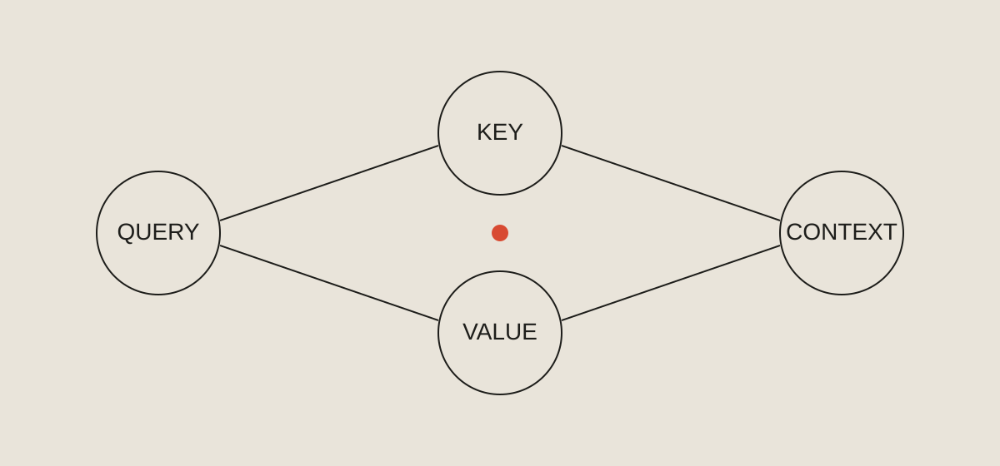

注意力机制（Attention）常常被一堵记号之墙介绍出来：矩阵、维度、缩放因子、softmax。但如果我们先放下记号，它其实只在回答一个很小、也很实用的问题：**此刻，这个 token 应该看向哪里？**[^1]

这篇笔记不打算推导完整的 Transformer，而是沿着一个问题往下走：从查询、键、值开始，经过缓存，最后落回一个能在小模型上跑起来的实现。它适合已经见过 Attention 公式、但始终觉得“知道符号却不理解动机”的读者。

## 先问一个很小的问题

一句话不是一袋孤立的词。在“河流到达了岸边”里，“岸”的含义取决于它周围的词；在 `DeepSeek-V4-Flash` 这样的专有名词里，`Flash` 的含义又取决于前缀。语言的意义大量地存在于**关系**之中，而不是单个符号里。

注意力机制给了模型一种度量这些关系的方式。它不存储固定的规则，而是针对**当前上下文**现场计算相关性。这一点是理解它的关键，也是它比早期方法更灵活的原因。

三个熟悉的名字描述的其实是三种角色：

- **Query（查询）** —— 我在寻找什么？
- **Key（键）** —— 我包含什么？
- **Value（值）** —— 我能贡献什么信息？

> 注意力不是记忆。它是在收集信息之前，先决定去看哪里的一种方式。


*图 1 — 三种角色各自回答一个不同的问题，最终汇集成上下文。*

如果你只记住一件事，请记住这个：相关性是计算出来的，而不是存储下来的。

## 最小的可用版本

把机制写成简化的伪代码，它短得几乎令人意外：

```ts
const scores = query.map((q) => keys.map((k) => similarity(q, k)));
const weights = softmax(scores);
const context = weightedSum(weights, values);
```

代码不是难点。真正需要建立直觉的是那三次映射：**查询与键决定“看哪里”，softmax 把相关性变成权重，值负责把被选中的信息搬过来。** 缩放因子、多头、位置编码，都是在解决这套朴素版本的工程问题，而不是改变它的本质。

### 一个实用的阅读策略

当一段技术解释变得密集时，反复回到三个问题，往往比继续读下去更有效：

1. 什么信息进入了这个运算？
2. 它做出了什么决定？
3. 结果改变了什么？

| 问题 | 它帮你弄清楚 |
| --- | --- |
| 什么进入了运算 | 输入的形状与来源 |
| 它决定了什么 | 机制的目的 |
| 什么因此改变 | 输出为何可信 |

这个方法远不止适用于注意力机制。它是让任何系统变得不那么神秘的可靠方式。

## 为什么需要 KV Cache

训练时，我们通常一次性看到整段序列，注意力可以并行计算。但在**推理**阶段，模型一次只生成一个 token，于是每一轮都要重新计算此前所有位置的键与值——如果不做任何优化，这会让生成长文本的代价随时间平方增长。[^2]

KV Cache 的想法非常朴素：既然历史位置的键和值不会改变，就把它们缓存下来，每一步只计算新 token 的查询、键和值，再与缓存拼接。

```python
# 每一步只计算新 token 的 q, k, v
q, k, v = project(x_new)
cache_k = concat(cache_k, k)
cache_v = concat(cache_v, v)
scores = q @ cache_k.transpose(-2, -1)
context = softmax(scores) @ cache_v
```

缓存带来的收益是线性的内存增长换取了接近线性的计算增长。代价同样真实：显存占用随序列长度增长，长上下文推理因此常常是**内存受限**而非算力受限。这也解释了为什么围绕 KV Cache 的压缩、量化与淘汰策略会成为工程上的热门话题。



*图 2 — 缓存随生成过程累积，显存占用随序列长度线性增长。*

### 缓存到底缓存了什么

值得强调的是，缓存里存的是**键和值**，而不是查询。查询属于“此刻”，每个新位置都会产生一个新的查询；而键和值属于“过去”，一旦算出来就不再变化。理解这一点，就理解了为什么缓存能够成立。

| 维度 | 含义 | 是否随位置变化 | 是否可缓存 | 备注 |
| --- | --- | --- | --- | --- |
| Query | 此刻的提问 | 是 | 否 | 每个新 token 都会重新产生 |
| Key | 对自身内容的声明 | 否 | 是 | 历史位置一旦算出便不再改变 |
| Value | 愿意交出的信息 | 否 | 是 | 与 Key 同步缓存 |
| Context | 加权求和后的结果 | 是 | 否 | 完全由当前 Query 决定 |

这张表也解释了为什么缓存能够成立：可缓存的部分恰好是那些不随位置变化的部分。

## 把它缩小到一个可以跑的例子

大型模型的注意力层对我们并不友好：它被淹没在分布式、并行与算子优化里。一个小模型——比如 `miniMind` 这样的教学实现——反而更适合用来建立直觉，因为它足够小，小到你可以把每一层的形状都打印出来。


*图 3 — 完整的数据流：查询、键、值在缓存之上汇合，最终得到上下文。*

我通常按下面的顺序做实验：

- 先固定一个很短的序列，把注意力权重打印成矩阵，观察它是否“看向”了合理的词；
- 再把序列加长，比较有缓存与无缓存的输出是否一致；
- 最后把某一层的键替换成随机的值，观察生成结果如何崩坏。

这些实验都不需要训练，却能迅速把抽象概念变成可观察的现象。你会开始对“模型在看哪里”产生具体的判断，而不是停留在“它有注意力”这种模糊的印象上。


*图 4 — 把注意力权重打印成矩阵，是建立直觉最快的方式。*

## 回到最初的问题

现在我们再回头看那三个名字，它们已经不再是记号：

- 查询是此刻的提问；
- 键是过去每个位置对自身内容的声明；
- 值是过去每个位置真正愿意交出的信息。

注意力之所以强大，不是因为它复杂，而是因为它把“该看哪里”这件事，交给了数据本身去决定。缓存之所以重要，是因为它承认了一个工程事实：**在真实系统里，正确的算法往往还需要正确的数据流。**

公式当然重要。但理解通常始于更早的一层：先想清楚这些公式究竟在完成什么工作。对 KV Cache 如此，对更长的上下文、更省的内存，同样如此。

---

如果你想继续往下读，可以从 [Attention Is All You Need](https://arxiv.org/abs/1706.03762) 这篇论文开始，也可以参考一份很长的实现笔记：https://example.com/notes/attention/kv-cache/implementation-details/very-long-path-without-spaces-abcdefghijklmnopqrstuvwxyz0123456789

[^1]: 这里的“看向”是一种拟人化的说法。严格来说，它描述的是加权求和的方向，而不是任何形式的意图。

[^2]: 准确的复杂度取决于实现细节，但“重复计算历史键值”带来的额外开销是真实且显著的。
